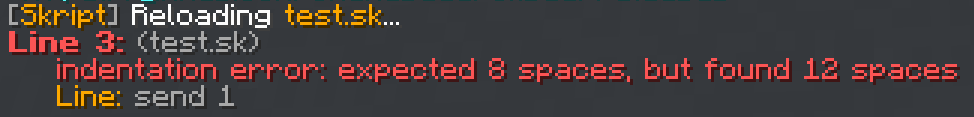
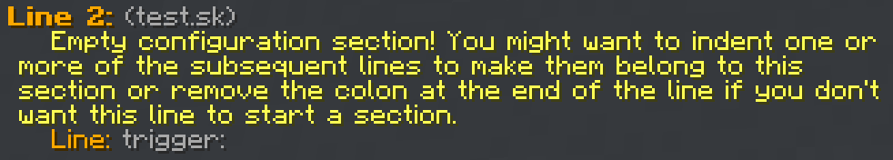
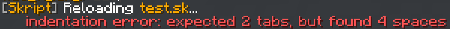

# **스크립트 기초**

## <span class="title">들여쓰기</span>
들여쓰기는 **Tab** 또는 스페이스바 4번(설정에 따라 스페이스바 2번일 수도 있음)으로 한다.  
구문을 적다가 콜론(:)으로 마무리했을 때는 그 다음 줄은 무조건 들여쓰기를 추가한다.  

ex)
```vb
command /test <integer>:
    trigger:
        if arg 1 is 1:
            send "1을 입력했습니다."
        else:
            send "1을 입력하지 않았습니다."
```

들여쓰기는 이벤트, 조건문, 반복문을 사용할 때 적는다.  

---

## <span class="title">스크립트 문법</span>

### 주석: `#`

ex)
```vb
# 설명을 적는다 (구문으로 인식되지 않음)
```

---

### 변수: `{}`

ex)
```vb
{_변수명}
{변수명}
{변수명::*}
```

(자세한 설명은 변수 문서 참고)

---

### 문자열

ex)
```vb
"abc"
"123"
"가나다"
"안녕하세요%nl%반가워요"
```

※참고※
문자열에서 엔터는 <span class="ce">\n</span>이 아니라 <span class="cb">%nl%</span>이다.

---

### 조합값
문자열 안에 특정 값을 적용: `%%`  

ex)
```vb
%player%
%uuid of player%
%world of player%
%arg 1%
```
---

## <span class="title">리로드</span>  
스크립트 파일을 새로 만들거나 가져오거나 수정했을 때 그 변경사항을 서버에 적용하려면 `/sk reload` 파일명 이라는 명령어를 입력해 줘야 한다.  

ex1)  
파일명: test.sk  
`/sk reload test.sk`  

ex2)  
파일명: 테스트.sk  
`/sk reload 테스트.sk`  

---

### 리로드 성공
리로드가 성공적으로 진행되면 <span class="ca">초록색 글씨</span>로 아래 사진처럼 뜬다.  


---

### 리로드 오류
만약 리로드 중 오류가 발견되면 <span class="cc">빨간색 글씨</span>로 아래 사진처럼 뜬다. 

내용은 다양하게 있겠지만, 위와 같이 **expected N1 spaces, but found N2 spaces** 라는 문구가 뜬다면 `:`을 적어야 하는 곳에 적지 않았거나 탭 수가 잘못 되었는지 다시 한번 확인해보면 된다.  

---

### 리로드 경고
만약 <span class="ce">노란색 글씨</span>로 아래와 같이 뜬다면 오류가 아니며 작동에는 문제가 없지만, 주의하라는 경고 표시이다.  

되도록이면 경고 표시가 뜨지 않게끔 스크립트를 작성하는게 좋다.  

---

### 자주 볼 수 있는 상황
아래와 같은 오류가 났다면 스페이스와 탭을 섞어서 사용했기 때문이다.  
  스페이스 또는 탭으로 통일 시켜주면 해결된다.  

