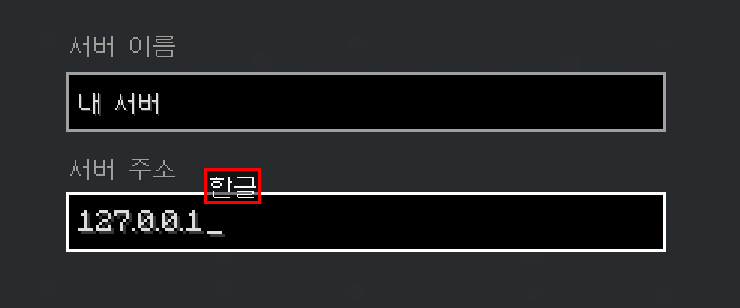
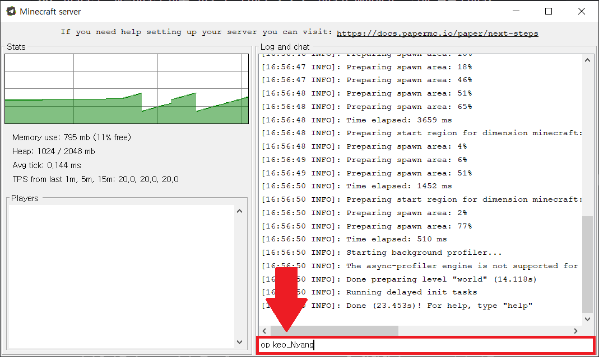

# **싱글 서버 만들기**

> ※ 이 글은 mc1.21.3을 기준으로 작성한 글입니다 ※

---

## 버킷

1. 자바를 다운로드한다. (링크 참고)  
2. 다운로드한 자바를 실행시킨 후 **Next >> Next >> 기다리기 >> Close**  
   (자바 설치가 완료되었다)  
3. paper 버킷을 다운로드한다. (링크 참고)  
4. start.bat 파일을 다운로드한다. (링크 참고)  
5. 서버로 만들 새 폴더를 만든다. (폴더 이름은 마음대로 정하되 유니코드 사용 금지!!)  
6. 방금 만든 폴더에 자바를 제외하고 다운로드한 파일을 모두 넣는다.  
   (paper 버킷, start.bat)  
7. start.bat 파일을 좌클릭 후 우클릭해서 편집에 들어간다.  
   (경고창이 뜬다면 "추가 설명 >> 실행"을 누른다, 메모장이 열릴 것이다)  
8. `"버킷이름"` 이라고 적힌 부분에 다운로드한 paper 버킷 이름을 그대로 적고 저장한다.  
   ex) `java -Xms1024M -Xmx2048M -jar paper-1.21.3-82.jar`  
9. start.bat 파일을 실행한다.  
10. 실행 후 `eula.txt` 파일이 생성되면 열어서  
    `eula=false` → `eula=true` 로 바꾸고 저장한다.  
11. 다시 start.bat 파일을 실행하면 서버가 열린다 🎉  

✅ 서버 완성

---

### 📎 참고 링크
- [자바 다운로드](https://bit.ly/3PvQvaX)  
- [Paper 버킷 다운로드](https://papermc.io/downloads/paper)  
- [start.bat 다운로드](https://bit.ly/3PvzdL1)  

---

## 서버 주소

1. 마인크래프트에서 **멀티플레이**로 들어간다.  
2. **서버 추가**를 누르고 서버 주소에 127.0.0.1을 입력한다.  
   (서버 이름은 마음대로 정하기)  

3. 완료를 누르고 접속한다.  

✅ 서버 접속 완료!

---

## 오피(op)

1. 버킷 창에서 표시된 부분에 op 자신의닉네임을 입력한다.  
   (아래 사진 참고)  

2. 엔터를 치면 자신에게 오피(op) 권한이 들어온다.  

✅ 오피(op) 권한 얻기 완료!

---

## 서버 끄기

1. 버킷 창에서 stop을 입력하거나,  
   마인크래프트 서버에 접속한 후 오피 상태에서 /stop을 입력한다.  
2. 엔터를 치면 서버가 종료된다.  

✅ 서버 끄기 완료!
